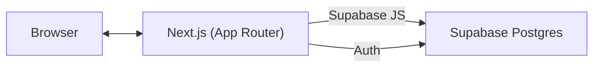

# DraftBox — Markdown 下書き保存・共有ツール

[](https://draftbox-pearl.vercel.app/)


**DraftBox** は、Markdown で下書きを「**作成／自動保存／共有**」できる Web サービスです。  
認証とデータ管理は **Supabase**、ユーザー境界は **RLS（Row Level Security）** で保護しています。

> 公開URL: https://draftbox-pearl.vercel.app/

---

## 特徴
- **下書き管理**：新規／自動保存／即時保存／削除  
  └ 制約: タイトル120文字, 本文200KB, ユーザー1000件
- **Markdown エディタ**：`react-simplemde-editor` を採用
- **文字数カウント**：通常／改行除外／空白除外、バイト数（UTF-8/UTF-16/SJIS/EUC-JP/JIS 概算）、行数・原稿用紙換算
- **共有リンク**：閲覧専用 URL を本人のみ発行可能、期限（なし／24h／7d／任意）、更新／無効化対応
- **エクスポート**：Markdown / HTML / プレーンテキスト
- **認証**：ユーザー登録／ログイン／ログアウト／パスワードリセット (Supabase Auth)
- **多言語対応**：日本語／英語
- **UI/UX**：ダークモード、検索・フィルタ・並べ替え

---

## 技術スタック
- **フロントエンド**: Next.js (App Router, v15) / React 19
- **バックエンド**: Supabase（Auth・DB・RLS）
- **エディタ**: `react-simplemde-editor`, `marked`, `DOMPurify`
- **ホスティング**: Vercel



---

## ローカル開発

本番環境は Vercel、認証とデータベースは Supabase を使います。ローカル開発は Docker Compose で実行できるため、WSL の作業ツリーへ Node 依存関係を直接インストールしなくても動かせます。

環境変数ファイルを作成します。

```bash
cp .env.example .env.local
```

Supabase の公開 URL と anon key を設定します。anon key はブラウザから利用する公開キーです。

```bash
NEXT_PUBLIC_SUPABASE_URL=...
NEXT_PUBLIC_SUPABASE_ANON_KEY=...
NEXT_PUBLIC_BASE_URL=http://localhost:3000
```

開発サーバーを起動します。

```bash
docker compose up --build
```

ブラウザで開きます。

```text
http://localhost:3000
```

停止します。

```bash
docker compose down
```
